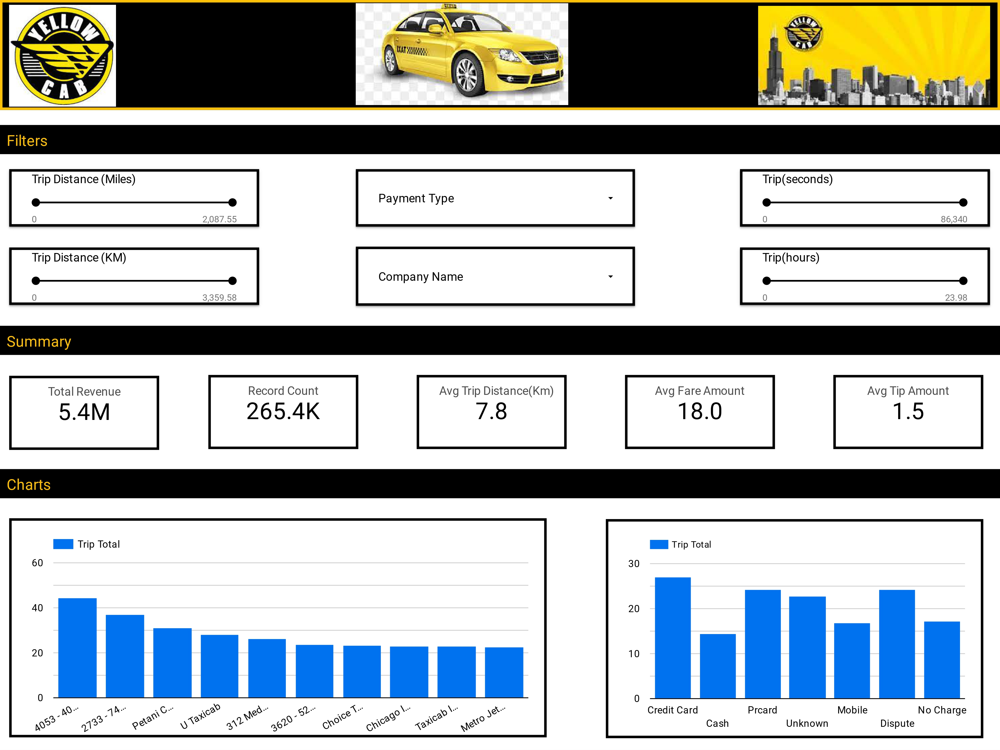

# Chicago Taxi Trip Data Analytics - Modern Data Engineering GCP Project

## Introduction

The aim of this project is to perform data analytics on Chicago Taxi Trip data using various tools and technologies including Python, SQL, Mage Data Pipeline Tool, GCP Storage, Compute Instance, BigQuery and Luker Studio.

## Architecture 

## Data Source
Chicago Taxi Trip datasets was extracted using the [Chicago Data Portal API Endpoint](https://data.cityofchicago.org/resource/wrvz-psew.json) with the columns recording information on trip start and end date time, trip in seconds, trip in miles, pickup and dropoff community area, fare, tips, payment type, company, pickup and dropoff locations. 

Community area data that contains the pickup and dropoff community area name was used to enriched the Chicago Taxi trip data.

Data Source Link
1. [Chicago Taxi Trip ](https://data.cityofchicago.org/Transportation/Taxi-Trips/wrvz-psew)
2. [Community Area](https://data.cityofchicago.org/Facilities-Geographic-Boundaries/Boundaries-Community-Areas-current-/cauq-8yn6)

Data Collection and transformation Scripts
- [Data Collection](https://github.com/Krismars19/chicago-etl-pipeline-data-engineering-project/blob/main/Data_collection_transformation.ipynb)
- [Chicago Taxi Trip ETL pipeline project](https://github.com/Krismars19/chicago-etl-pipeline-data-engineering-project/blob/main/Chicago-Taxi-Trip-ETL-pipeline-project.ipynb)
- [Mage Files](https://github.com/Krismars19/chicago-etl-pipeline-data-engineering-project/tree/main/mage%20files)

## Data Model

## Data Visualization

Link: [Chicago Taxi Dashboard](https://lookerstudio.google.com/reporting/107f2984-6d16-49c6-ba6b-6ef988981dc3)

Credit
- [Uber Data Analytics | End-To-End Data Engineering Project by Darshil Parmar](https://www.youtube.com/watch?v=WpQECq5Hx9g)
  
